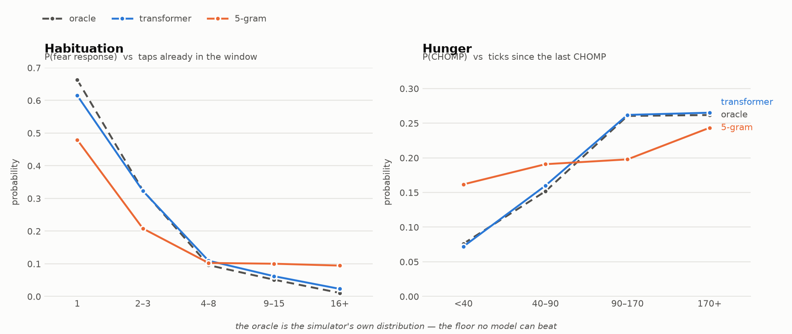

# tiny-tank

A 336,000-parameter transformer, written from scratch, that learned to behave like a fish.

**[Play with it →](https://arsallls.github.io/tiny-tank/)** — the whole model runs in your
browser. No server, no inference runtime, a hand-written forward pass in 189 lines of JS.

<picture>
  <source media="(prefers-color-scheme: dark)" srcset="figures/probes-dark.png">
  
</picture>

## The idea

Don't model the fish's *sounds* — a three-token "blub blub" vocabulary has nothing to
learn. Model its **behavior**. The fish's life is a token stream:

```
IDLE DRIFT_L HUNGRY BUBBLE SCAN DRIFT_R
<FOOD> ORIENT DART_U CHOMP GULP CONTENT SINK ...
```

32 tokens across stimuli, motion, actions, sounds and moods. That is an ordinary
autoregressive sequence problem, and the architecture is unchanged from a language
model — RoPE, RMSNorm, SwiGLU, tied embeddings, no biases. Your clicks are stimulus
tokens injected into the context, exactly like a chat turn.

## Why this needs a transformer

Because the fish has **hidden state you can only recover from long-range context**:

- **Habituation** — tap the glass and it startles. Tap it sixteen times and it ignores
  you. The evidence spans a 300-tick window.
- **Hunger** — accumulates steadily, and darting burns it faster. About 90 seconds from
  fed to hungry again.
- **Sleep debt** — it tires while the light is on and recovers in the dark. Leave the
  light on too long and it naps anyway.

Nothing in the token stream states either one. Mood tokens fire only on the tick they
*change*, so a model that copies the previous mood learns nothing.

The training data is synthetic, from [`sim.py`](sim.py). That is the point rather than a
shortcut: because the generating distribution is known, `sim.py --oracle` reports the
**irreducible entropy** — the score no model can beat. Almost no real task lets you
measure that.

## Results

All three scored by the same estimator ([`eval.py`](eval.py), 20k random positions,
512 tokens of context):

| model | val bits/token | gap to floor | hunger swing |
|---|---|---|---|
| **oracle** (the simulator itself) | **2.5616** | — | 3.44× |
| **transformer** (336k params) | **2.6087** | 0.047 | **3.68×** |
| 5-gram | 2.8662 | 0.305 | 1.50× |
| 3-gram | 2.9398 | 0.378 | 1.19× |
| 2-gram | 3.1584 | 0.597 | flat |

The transformer closes **84.5% of the gap** between the best n-gram and the entropy of
the process itself, and lands 1.8% above irreducible.

**The hunger probe is the clean kill.** A 5-gram predicts a 0.162 chance of a chomp for
a fish that ate 30 ticks ago, where the truth is 0.076. It cannot see the meal, and no
amount of data fixes that — the evidence does not fit in four tokens.

**Habituation is a more interesting story than I expected.** The 5-gram *partially*
recovers it (0.479 → 0.094, monotone), because taps inside a burst arrive densely enough
that two or three land in a four-token window. It counts taps it can see and flatlines
past that. Context length buys exactly as much as the evidence's span.

### The model is bigger than it needs to be

| config | params | val bits/token | probe deviation from oracle |
|---|---|---|---|
| 2L / 64d | 0.11M | 2.5181 | 0.188 |
| **3L / 96d** | **0.33M** | 2.5155 | **0.113** |
| 4L / 128d | 0.86M | 2.5096 | 0.214 |

(`train.py`'s estimator — internally comparable, not comparable to the table above.)

8× the parameters buys **0.0085 bits**. The task saturates by ~110k parameters. The 336k
model ships because it tracks the oracle's *shape* best, not because it scores best.

## Reading the hidden state back out

The model has no hunger variable, no fear variable, no clock. But the page shows bars
for all three, because the state can be **read out of the model's own next-token
distribution**. Validated against the simulator's true hidden values over 1800 ticks:

| bar | readout | r vs the simulator's real value |
|---|---|---|
| drowsy | P(SLEEPY)+P(HOVER)+P(SINK)+P(DRIFT_D) | **+0.905** |
| fear | P(HIDE)+P(STARTLED)+P(SPLASH)+P(DART_D) | **+0.882** |
| hunger | P(SCAN)+P(SURFACE)+P(HUNGRY) | **+0.841** *while awake* |

Two of those numbers cost a debugging cycle each.

The first hunger readout included `CHOMP` and `NIBBLE` and came out *negatively*
correlated (−0.225): those tokens fire on food being **present**, and food arrives
independently of how hungry the fish is.

Hunger is qualified "while awake" because a sleeping fish displays no hunger behaviour
at all — the readout collapses and r falls to +0.31 over sleeping ticks, dragging the
all-ticks figure to +0.54. Rather than show a confidently wrong 0%, the page **blanks
the hunger bar while the fish sleeps**. Holding the last value instead was tried and
does not work (+0.532): hunger keeps rising while the fish is asleep, so the held value
is stale by the time it wakes.

The practical payoff: tap the glass repeatedly and watch the fear bar drain —
**29% → 22% → 14% → 7% → 3% → 2%** across sixteen taps. Habituation as a bar you empty
by clicking the same button.

## Running in a browser

`export.py` writes the weights as a flat float32 binary plus a manifest, and
[`docs/model.js`](docs/model.js) implements the forward pass directly — RMSNorm, RoPE,
attention with a KV cache, SwiGLU, tied unembedding. 1.3MB of weights and no dependency;
shipping an ONNX runtime would cost more to download than the model.

It also writes `parity.json`: a fixed input plus the logits PyTorch produced for it, at
**every** position rather than just the last, because a transposed RoPE is invisible at
position 0 and grows with index. The page re-runs that fixture on load and shows the
result — currently **1.29e-5** max absolute difference, which is float32 accumulation
order. The check runs in the environment that ships, so a bug can't pass in one
toolchain and fail in the other.

One thing deliberately *not* ported: `model.py`'s sliding-window path freezes the RoPE
position once the cache fills, which collapses every relative offset to zero and
silently disables RoPE. `model.js` keeps counting absolute positions and evicts the
oldest key, so a tank left open overnight behaves the same as one just opened.

## Reproduce

No GPU needed at all — the whole pipeline runs on a laptop CPU in about 13 minutes,
of which 12 is training. (On an L4 the training step is 40 seconds, but generating the
corpus is pure Python and runs *slower* on a Colab vCPU than on a laptop, so the GPU
saves less than it looks.)

```bash
python3 sim.py --episodes 8000      # 16M tokens from seed 1337
python3 sim.py --oracle --episodes 8000
python3 eval.py --orders 2 3 5      # baselines, before training anything
python3 train.py --n-layer 3 --n-head 3 --n-embd 96 --max-iters 1500 --out-dir out/m
python3 eval.py --orders 5 --ckpt out/m/tank.pt
python3 export.py --ckpt out/m/tank.pt
python3 plot.py
python3 -m http.server --directory docs
```

The corpus is not committed because the seed *is* the corpus — `sim.py` regenerates it
byte-identically in 96 seconds.

## Notes

- **Baselines were run and gated on before any training.** If a 5-gram had matched the
  probe curves, the simulator needed fixing and no amount of model would have helped.
- **The context window is the fish's whole memory** — 512 tokens, about two minutes. I
  expected the 500+ hunger bucket to fail because 500 ticks don't fit. It didn't:
  0.282 against the oracle's 0.255. The model reads `SCAN`, `SURFACE` and the absence of
  `CHOMP` as evidence of a starving fish instead of counting ticks. It learned the
  symptom, not the clock.
- **The page seeds the model with 32 tokens of awake behavior.** From a cold context the
  fish spends 44% of a visitor's first minute asleep and 6 visits in 20 sleep through it
  entirely. The seed cuts that to 25% — its own natural rate — with a far tighter spread.
  Longer seeds score a better mean but *worse* variance; 192 tokens of hand-written
  behavior is off-distribution and the model answers erratically.
- **Probe buckets have to track the phenomenon's timescale.** When hunger was made 2.5×
  faster, the old `<100 / 100–250 / 250–500 / 500+` bins all measured the same
  fully-hungry fish and the oracle's own swing collapsed from 4.5× to 2.1×. Re-cutting
  them at `<40 / 40–90 / 90–170 / 170+` restored it to 3.4×. The measurement was broken,
  not the model.
- **Mood and behaviour have to agree about precedence.** `current_mood()` ranked sleep
  above hunger while `menu()` ranked hunger above sleep. At 12% hunger that was
  invisible; at 47% it meant a drowsy fish announced `SLEEPY` while foraging, and half
  of all drowsiness never reached the behaviour the model learns from. The drowsy gauge
  sat at r = 0.49 until the orders matched, then jumped to 0.91.
- **Faster state makes n-grams stronger.** Speeding hunger up for the sake of the demo
  also shortened the window the evidence lives in, which is exactly what a 5-gram can
  see. Its hunger swing went 1.50× while the oracle's fell 4.5× → 3.4×. Interactivity
  and experimental separation pull against each other here.

## Layout

```
sim.py        behavior simulator + the oracle
model.py      the transformer (~250 lines)
train.py      training loop
eval.py       n-gram baselines + the two probes
export.py     checkpoint -> weights.bin + config.json + parity.json
plot.py       the figures above
docs/         the page: model.js, tank.js, index.html, weights
```
